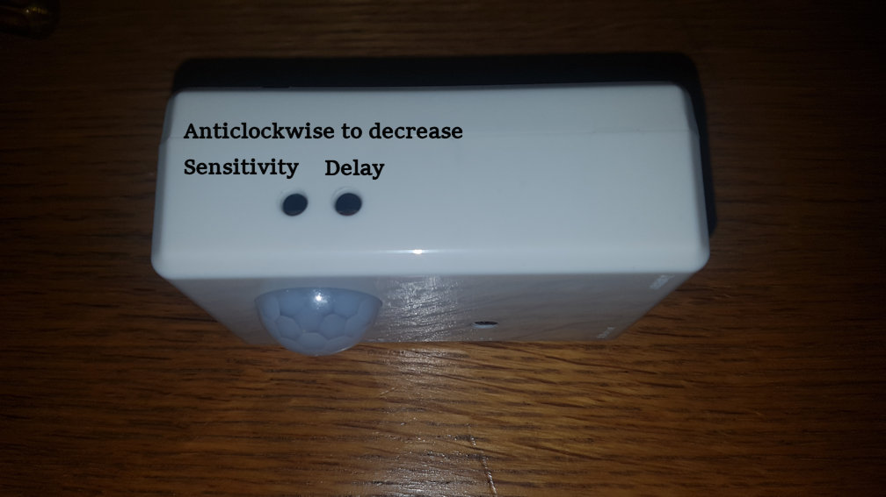

- [Introduction](#Introduction)
- [License](#License)
- [Contribution](#Contribution)
- [Requirements](#Requirements)
- [Getting started](#Getting-started)
- [Running as a Service](#Running-as-a-Service)
- [Mounting an NFS drive for off device video storage.](#Mounting-an-NFS-drive-for-off-device-video-storage)
- [LED disabling](#LED-disabling)
- [PIR adjustment details](#PIR-adjustment-details)
- [Help position camera](#Help-position-camera)
- [Future Ideas](#Future-Ideas)

# Introduction
I was unhappy with the basic functionality of the code available for using the Raspberry Pi camera with a PIR sensor.

Many examples focussed on taking still images or video only when the sensor was triggered or were very low framerates due to doing image based motion detection.

My experience of even commercial CCTV IP camera is that motion detection usually missed important details as the "pre event" buffers possible were a couple of seconds. The best setup I found was to do 24x7 recording with a notification with a still image of any event so that you could login and review all the video.

This code records constantly to MP4 video in 1 minute sections and emails an image when the PIR is triggered. It also handles old video cleanup that are older than X days old.

It is capable of recording at 1640x1232 at 25 frames a second to a NFS share over WiFi or to the SD card (it uses Mode 4 of the camera to use the full sensor width). It also uses VBR to keep the video file sizes to a minimum.

# License
The code is GPL v3, Please read the [License file](License)

As per the License there is NO Warrenty, use at your own risk.

# Contribution
Bug's, feature ideas, push requests are welcome but might not be acted upon.

# Requirements
This code is designed to work with [SB Component SPI-Box](https://www.sb-components.co.uk/spi-box.html) starter kit which include the box and PIR Sensor.

You will also need a Raspberry Pi 3B+ and a V2.1 Raspberry Pi Camera and power supply.

This code only works on Raspian Buster (Python 3.7) due to Bugs in the old version of Python Multiprocessing Module used in earlier Raspian releases.

# Getting started
Create a configuration file named "security.ini" using [security.ini.example](security.ini.example) as a base.

Please read the code and Python Modules documentation for additional understanding of the settings.

Run
```
python3 security.py
```
For full functionality.

or

Run
```
python3 just_record.py
```
For just recording and cleanup, no PIR or email functionality.

# Running as a Service
Edit the pir-security.service.example file and save the edited file /etc/systemd/system/pir-security.service

Reload the systemd config with:
```
sudo systemctl daemon-reload
```

Start the service with:
```
sudo systemctl start pir-security
```

# Mounting an NFS drive for off device video storage.
Edit "/etc/fstab" adding a line like:-
```
hostname:/picam	/mnt	nfs	defaults,noauto,x-systemd.automount	0	0
```
The "x-systemd.automount" option delays automounting until the network is available.

# LED disabling
Edit /boot/config.txt to add:-
```
# Disable the ACT LED.
dtparam=act_led_trigger=none
dtparam=act_led_activelow=off

# Disable the PWR LED.
dtparam=pwr_led_trigger=none
dtparam=pwr_led_activelow=off
```

# PIR adjustment details
As it is not labeled on the box or in any documentation provided please see the below image on the PIR Sensor adjustment.


# Help position camera
You can stream video to VLC with, it has a bit of latency but is just good enough
```
raspivid -o - -t 9999999 -w 800 -h 600 --hflip --vflip | cvlc -vvv stream:///dev/stdin --sout '#standard{access=http,mux=ts,dst=:8080}' :demux=h264
```

# Future Ideas
Wiring up to a doorbell button and door bell chime, so an image is taken and emailed when the door bell button is pressed.

Wiring up to a Magnetic door reed switch, so an image is taken and emailed when a door is opened.